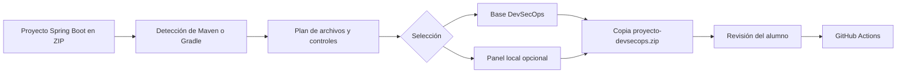

# Inicializador DevSecOps

Aplicación educativa que incorpora controles DevSecOps en un proyecto Spring Boot existente. Recibe un archivo ZIP, analiza su estructura y devuelve una copia independiente con la configuración de seguridad preparada.

- **Versión actual:** `0.9.4`
- **Aplicación desplegada:** <https://start.cgarcher.dev/>

El proyecto original nunca se modifica. El alumno revisa el plan antes de generar la copia y decide después qué cambios conserva.

## Recorrido del alumno



El inicializador no es un analizador de vulnerabilidades. Su función es preparar el proyecto para que GitHub Actions ejecute Semgrep, CycloneDX y Trivy de una forma repetible y comprensible.

## Qué incorpora

### Base DevSecOps

Se añade en todos los proyectos generados:

| Elemento | Para qué sirve |
| --- | --- |
| `.github/workflows/devsecops.yml` | Ejecuta los análisis en GitHub Actions. |
| `.devsecops/engine/` | Contiene el perfil de Spring Boot, las reglas, la normalización y la política. |
| `.devsecops/config.yml` | Registra la configuración detectada para el proyecto. |
| `.devsecops/manifest.json` | Guarda la versión del paquete incorporado. |
| `.github/rulesets/` | Incluye reglas importables para proteger `develop` y `main`. |
| `SECURITY_SETUP.md` | Explica la configuración necesaria en GitHub. |
| `docs/devsecops/guia-del-estudiante.md` | Ayuda a interpretar el flujo y comprobar una corrección. |

### Panel local y remediación asistida

Esta opción es voluntaria. Añade:

| Elemento | Para qué sirve |
| --- | --- |
| `compose.security.yml` | Inicia el panel local mediante Docker Compose. |
| `.devsecops/dashboard/` | Contiene el panel y la lógica para leer los informes. |
| `.devsecops/dashboard.env.example` | Muestra las variables que debe completar el alumno. |
| `docs/devsecops/dashboard.md` | Explica cómo configurar y arrancar el panel. |

El panel puede consultar la API de remediación ya desplegada. La inteligencia artificial no recibe el repositorio completo, no modifica archivos y no aplica cambios automáticamente.

## Utilizar la aplicación web

1. Abre <https://start.cgarcher.dev/>.
2. Elige si quieres añadir únicamente la base DevSecOps o también el panel local.
3. Selecciona el ZIP del proyecto Spring Boot.
4. Revisa el perfil detectado y los archivos que se van a incorporar.
5. Descarga la copia. El nombre conserva el original y añade el sufijo `-devsecops.zip`.

La interfaz admite proyectos Maven y Gradle. Si no existe Dockerfile, el análisis del contenedor queda registrado como `NOT_APPLICABLE`; esto no significa que el proyecto esté libre de vulnerabilidades.

## Qué hacer después de descargar el ZIP

1. Descomprime la copia y comprueba los archivos añadidos.
2. Publica el proyecto en GitHub. El workflow es autónomo y no necesita acceder al repositorio del inicializador.
3. Abre **Actions** y revisa la primera ejecución de `Seguridad DevSecOps`.
4. Sigue `SECURITY_SETUP.md` para importar manualmente los *rulesets* de `develop` y `main`.
5. Corrige los hallazgos en una rama y repite el análisis antes de integrar el cambio.

El workflow utiliza el token temporal de GitHub Actions. No hace falta configurar un token personal para ejecutar los análisis.

### Configurar el panel opcional

El token personal solo es necesario si se ha incluido el panel y se quieren descargar los informes desde el equipo local:

```powershell
Copy-Item .\.devsecops\dashboard.env.example .\.devsecops\dashboard.env
```

Completa `.devsecops/dashboard.env` con:

- `GITHUB_REPOSITORY`: repositorio con el formato `propietario/repositorio`.
- `GH_TOKEN`: token *fine-grained* con **Actions: Read** y **Contents: Read**.
- `AI_API_TOKEN`: token facilitado para consultar la API de remediación.

Después inicia el panel:

```bash
docker compose -f compose.security.yml up -d --build
```

Abre <http://localhost:8081> y pulsa **Buscar último informe**. El fichero real `dashboard.env` está excluido de Git y no debe publicarse.

## Límites y protección del ZIP

| Límite | Valor | Motivo |
| --- | ---: | --- |
| Tamaño del ZIP | 25 MB | Es suficiente para proyectos de clase sin incluir binarios ni dependencias descargadas. |
| Número de elementos | 2.000 | Evita archivos con una cantidad desproporcionada de entradas. |
| Tamaño descomprimido | 150 MB | Reduce el riesgo de agotar los recursos del VPS compartido. |

También se rechazan rutas externas, intentos de ZIP Slip, enlaces simbólicos y ficheros cifrados. Las sesiones caducan a los 30 minutos y los archivos temporales se eliminan después de generar la copia.

Estos valores están pensados para los proyectos educativos previstos y pueden reajustarse si cambian las necesidades del aula o los recursos disponibles.

## Ejecutar el inicializador en local

### Con Docker

```bash
docker build -t devsecops-initializer .
docker run --rm -p 8080:8080 devsecops-initializer
```

Abre <http://localhost:8080>.

### Con Python

Se necesita Python 3.11 o superior:

```bash
python -m venv .venv
python -m pip install -e .
python -m devsecops_initializer.web --port 8080
```

En Windows puede ser necesario activar antes el entorno con `.\.venv\Scripts\Activate.ps1`.

## Uso por consola

Después de instalar el proyecto:

```bash
devsecops-init inspect ruta/al/proyecto
devsecops-init generate ruta/al/proyecto salida.zip
```

`inspect` muestra el diagnóstico sin modificar el proyecto. `generate` crea un ZIP nuevo con la base DevSecOps.

## Pruebas

```bash
python -m unittest discover -s tests -v
```

La versión `0.9.4` incluye quince pruebas automatizadas. Entre otros casos, comprueban Maven, la generación del workflow y las guías, el panel opcional, la ausencia de Dockerfile, la protección frente a ZIP Slip, la gestión de versiones, la limpieza de sesiones y el flujo web de carga y descarga.

## Arquitectura ampliable

El núcleo se mantiene separado de los perfiles. Cada perfil implementa cuatro operaciones: `detect`, `inspect`, `plan` y `learning_content`. Para añadir otro framework se crea una clase en `profiles/`, se registra en `registry.py` y se incorporan pruebas con un proyecto representativo.

- [`docs/architecture.md`](docs/architecture.md): organización interna y contrato de los perfiles.
- [`docs/student-workflow.md`](docs/student-workflow.md): propuesta de uso en una práctica.

Spring Boot es el primer perfil funcional. Laravel u otros entornos pueden añadirse sin cambiar el proceso de importación ni la interfaz principal.

## Repositorios del TFM

- [Caso de referencia Movie Review](https://github.com/CGARCHER/movie-review-devsecops-mvp).
- [API de remediación educativa](https://github.com/CGARCHER/ai-remediation).

---

Creado por [CGARCHER](https://github.com/CGARCHER).
